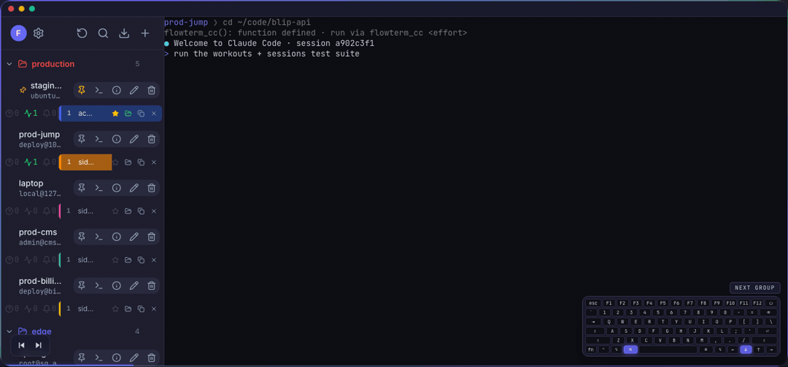

# Flowterm

> AI-era terminal · keyboard-first · synced across every machine.

**Flowterm wires you into Claude Code, Codex, or any AI coding CLI on any host in one keystroke.** It deploys your Clash and WireGuard proxies for you. It resumes every prompt and session exactly where you left off. Trackpad optional.

- Website: <https://flowterm.ai>
- Download: <https://flowterm.ai/#download> — macOS (Apple Silicon + Intel), Windows, Linux
- 1-month free trial · no card required

This repository is the **public issue tracker** for Flowterm. The product is closed-source; the application source lives in a private monorepo. File issues here and the team will triage them.

---

## What Flowterm does for you

### Your AI tool, wired in, in one keystroke
Pasting the launcher, picking the effort, hunting the right model — every time you start a session, on every host. **⌘.** launches Claude Code, **⌘;** launches Codex, with the effort and model you picked, on any host.

### That perfect prompt, one shortcut away
The prompt you wrote last week is somewhere in your shell history, on the wrong machine. Flowterm lets you save once, send to any session with one shortcut. Synced to every device, end-to-end encrypted. Edit in place.

### Clash + WireGuard, deployed for you
SSH to the router, edit YAML, restart mihomo, verify routes — gone. Flowterm pushes the config, restarts the runtime, verifies the routes, from the same window you're coding in.

### Pick up exactly where you left off
Closed your laptop, opened your desktop. Every tab, every session group, every active AI prompt is synced and restored on reconnect. Sub-second resume.

### Every action, one chord away
Ten fingers, no mouse. **⌘\\** for tmux, **⌘.** for Claude, **⌘;** for Codex, **⌘K** palette, **⌘E** shortcuts — fully editable, scriptable, synced.

### Your vault is yours, even from us
Your password derives the encryption key client-side. Hosts, prompts, Clash configs — server-side it's all ciphertext.

---

## From install to your first session in 90 seconds

1. **Install + sign in.** Download Flowterm. Sign in with email, GitHub, or Google. Your password derives an encryption key in your browser — the server never sees plaintext.
2. **One keystroke wires you in.** Press ⌘. for Claude Code or ⌘; for Codex on any host. Flowterm pastes the launcher, picks the effort, fires it.
3. **Walk away. Come back. Resume.** Sign in on a second machine — every host, prompt, Clash route, and active AI session is already there, restored in milliseconds.

---

## Platforms

| Platform | Architectures |
|---|---|
| macOS    | Apple Silicon (arm64), Intel (x64) |
| Windows  | x64 |
| Linux    | x64 (deb / AppImage) |

Zero open TCP ports. Every transport — REST, terminal byte stream, status push — runs through the in-process Tauri IPC bridge.

---

## Reporting issues

Pick the platform you prefer:

- **GitHub issues:** <https://github.com/flowterm-ai/flowterm/issues/new/choose>
- **GitLab issues:** <https://gitlab.com/flowterm.ai/flowterm/-/issues/new>

When filing a bug, please include:

- **Flowterm version** — visible in *Account → About*, or run `flowterm --version`.
- **OS and architecture** — e.g. `macOS 14.5 (arm64)`, `Ubuntu 22.04 (x64)`, `Windows 11 (x64)`.
- **Steps to reproduce** — what you clicked / typed, what you expected, what happened.
- **Logs** if relevant — `~/Library/Application Support/app.flowterm/flowterm.log` on macOS, the equivalent under `%APPDATA%\app.flowterm\` on Windows, `~/.local/share/app.flowterm/` on Linux. Redact anything sensitive before pasting.
- **Screenshots / screen recordings** for UI-visible issues.

For **security issues**, please email <support@flowterm.ai> directly instead of opening a public issue. We'll acknowledge within two business days.

---

## Feature requests

We read every one. Open an issue on either platform and tell us:

- The workflow you're trying to do.
- Where Flowterm gets in the way today.
- The shape of the fix you'd like (mockups, sketches, references all welcome).

Bigger requests may not ship — we keep Flowterm small and opinionated — but specific, well-described pain points are gold.

---

## License & ownership

The Flowterm name, logo, app binaries, website, and source code are © Flowterm. The desktop application is distributed under a commercial end-user license — see <https://flowterm.ai/terms>. Open-source components that Flowterm depends on are licensed under their respective licenses; a list is available on request at <support@flowterm.ai>.

This repository contains the public-facing introduction and issue tracker only. It does **not** contain the application source.

---

## Contact

- Support & sales: <support@flowterm.ai>
- Submit a ticket (web form): <https://flowterm.ai/submit-ticket>
- Status & changelog: <https://flowterm.ai>
